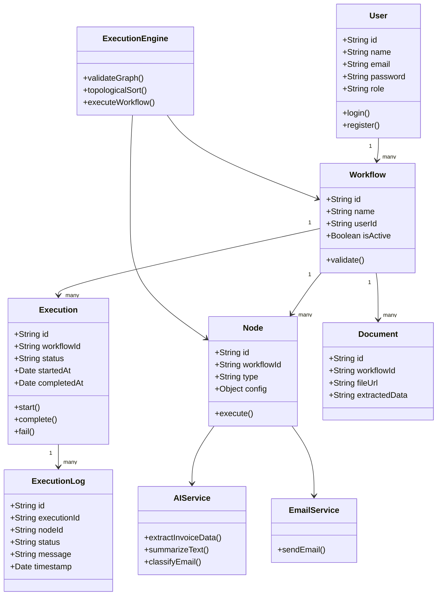

# Class Diagram

```mermaid
classDiagram

class User {
  +String id
  +String name
  +String email
  +String password
  +String role
  +login()
  +register()
}

class Workflow {
  +String id
  +String name
  +String userId
  +Boolean isActive
  +validate()
}

class Node {
  +String id
  +String workflowId
  +String type
  +Object config
  +execute()
}

class Execution {
  +String id
  +String workflowId
  +String status
  +Date startedAt
  +Date completedAt
  +start()
  +complete()
  +fail()
}

class ExecutionLog {
  +String id
  +String executionId
  +String nodeId
  +String status
  +String message
  +Date timestamp
}

class Document {
  +String id
  +String workflowId
  +String fileUrl
  +String extractedData
}

class ExecutionEngine {
  +validateGraph()
  +topologicalSort()
  +executeWorkflow()
}

class AIService {
  +extractInvoiceData()
  +summarizeText()
  +classifyEmail()
}

class EmailService {
  +sendEmail()
}

User "1" --> "many" Workflow
Workflow "1" --> "many" Node
Workflow "1" --> "many" Execution
Execution "1" --> "many" ExecutionLog
Workflow "1" --> "many" Document
ExecutionEngine --> Workflow
ExecutionEngine --> Node
Node --> AIService
Node --> EmailService
```