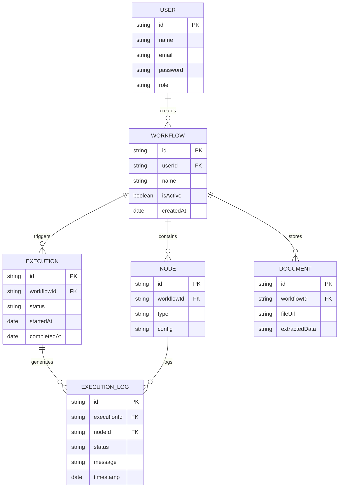

# ER Diagram

```mermaid
erDiagram

USER {
    string id PK
    string name
    string email
    string password
    string role
}

WORKFLOW {
    string id PK
    string userId FK
    string name
    boolean isActive
    date createdAt
}

NODE {
    string id PK
    string workflowId FK
    string type
    string config
}

EXECUTION {
    string id PK
    string workflowId FK
    string status
    date startedAt
    date completedAt
}

EXECUTION_LOG {
    string id PK
    string executionId FK
    string nodeId FK
    string status
    string message
    date timestamp
}

DOCUMENT {
    string id PK
    string workflowId FK
    string fileUrl
    string extractedData
}

USER ||--o{ WORKFLOW : creates
WORKFLOW ||--o{ NODE : contains
WORKFLOW ||--o{ EXECUTION : triggers
EXECUTION ||--o{ EXECUTION_LOG : generates
WORKFLOW ||--o{ DOCUMENT : stores
NODE ||--o{ EXECUTION_LOG : logs
```
