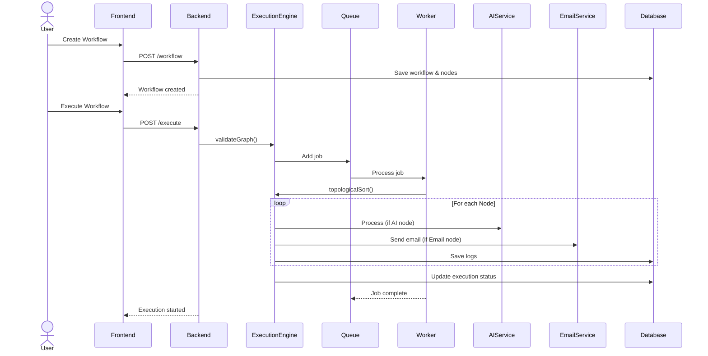

# Sequence Diagram

```mermaid
sequenceDiagram

actor User
participant Frontend
participant Backend
participant ExecutionEngine
participant Queue
participant Worker
participant AIService
participant EmailService
participant Database

User->>Frontend: Create Workflow
Frontend->>Backend: POST /workflow
Backend->>Database: Save workflow & nodes
Backend-->>Frontend: Workflow created

User->>Frontend: Execute Workflow
Frontend->>Backend: POST /execute
Backend->>ExecutionEngine: validateGraph()
ExecutionEngine->>Queue: Add job

Queue->>Worker: Process job
Worker->>ExecutionEngine: topologicalSort()

loop For each Node
    ExecutionEngine->>AIService: Process (if AI node)
    ExecutionEngine->>EmailService: Send email (if Email node)
    ExecutionEngine->>Database: Save logs
end

ExecutionEngine->>Database: Update execution status
Worker-->>Queue: Job complete
Backend-->>Frontend: Execution started
```