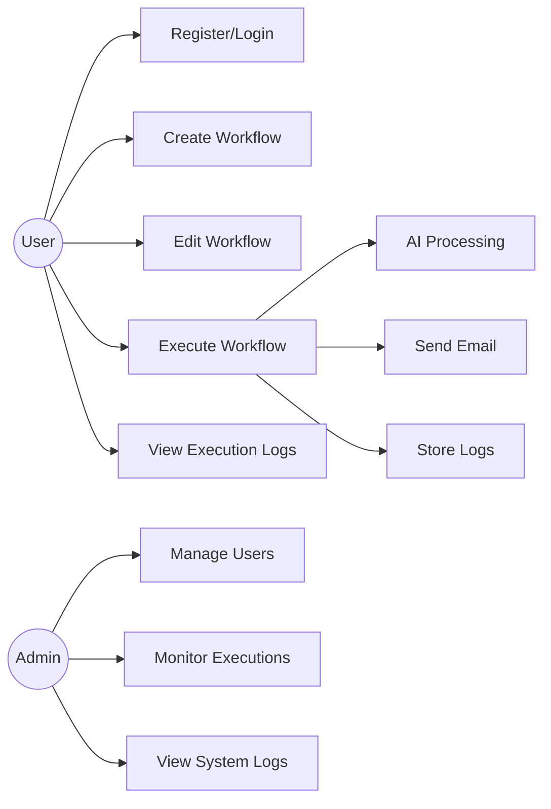

# Use Case Diagram

```mermaid
flowchart LR

User((User))
Admin((Admin))

User --> UC1[Register/Login]
User --> UC2[Create Workflow]
User --> UC3[Edit Workflow]
User --> UC4[Execute Workflow]
User --> UC5[View Execution Logs]

Admin --> UC6[Manage Users]
Admin --> UC7[Monitor Executions]
Admin --> UC8[View System Logs]

UC4 --> UC9[AI Processing]
UC4 --> UC10[Send Email]
UC4 --> UC11[Store Logs]
```